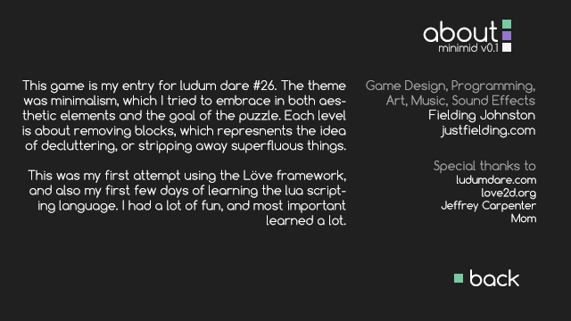

# Ludum Dare 25 Entry

This is my entry for
[Ludum Dare 25](http://ludumdare.com/compo/ludum-dare-26/?action=preview),
which took place on the weekend of April 26th-29th, 2013. The theme for this
competition was "Minimalism" and ther were a total of 2346 entries.

All code and assets were created during the 48hr time limit.

## Minimid

> ### Gameplay
>
> Minimod is a puzzle game consisting of a pyramid structured game board built of
> cubes. Each cube color represents a different state. The white cubes are
> considered empty spots, the purple cubes are filled spots. Teal is used to
> represent the currently selected cube.
>
> The goal of the game is to eliminate the game board to a single cube. This is
> done by jumping over cubes, similar to the way that checkers jump over enemy
> checkers to eliminate them. In order for a move to be legal, the selected cube
> must jump over an existing cube to get to the empty spot. However, each jump
> can only jump over one cube.
>
> To jump a cube, the user must first select the cube they wish to use. The
> currently selected cube is represented by highlighting, or changing the color
> to teal. Once the correct cube is highlighted, pressing enter will switch from
> selection mode to jump mode. Pressing enter again will cancel the jump mode and
> allow the user to select a different cube.
>
> Once in jump mode, the cube can be moved to the desired empty spot, assuming
> that the move is legal, as described above. Once the jump is complete, the cube
> that was jumped over is removed and the player is returned to selection mode.
>
> This process is repeated once the player has reduced the colored cubes down to
> a single cube. If the player wishes to reset the board at any time, the refresh
> button to the right can be clicked to do so.
>
> ### Controls
>
> #### Gameplay Control:
>
> The game board is loaded in select mode. From here the player uses w, a, s, d
> and enter to select purple cubes to use during the jumping mode. Once the
> desired cube is highlighted, indicated by the teal color, the player can lock
> on to the cube by pressing enter.
>
> Once a cube is locked on, the same keys, with the addition of q and e, are
> used to jump the selected cube to an open spot. Open spots are indicated by a
> white cube. The q and e keys were added to allow jumping over cubes to the
> left and right of the selected cube. After completing a jump, the player is
> put back in to cube select mode automatically.
>
> #### Gameplay Key Mapping:
>
> ##### Selecting a cube
> - w: up-left -- select the cube up-left from current selection
> - a: down-left -- select the cube down-left from current selection
> - s: down-right -- select the cube down-right from current selection
> - d: up-right -- select the cube up-right from current selection
> - enter: lock -- lock on to the currently selected cube
>
>##### Cube Jumping
> - w: up-left -- if an empty spot is available up-left from currently selected/locked cube, then it moves that cube there
> - a: down-left -- if an empty spot is available down-left from currently selected/locked cube, then it moves that cube there
> - s: down-right -- if an empty spot is available down-right from currently selected/locked cube, then it moves that cube there
> - d: up-right -- if an empty spot is available up-right from currently selected/locked cube, then it moves that cube there
> - q: left -- if an empty spot is available left from currently selected/locked cube, then it moves that cube there
> - e: right -- if an empty spot is available right from currently selected/locked cube, then it moves that cube there
> - enter: unlock -- allows you to unlock the currently locked/selected cube, so that you can select another one
>
> #### Interface Control:
>
> All interface buttons can be selected with the the mouse.
>
> The introduction/menu screen's options can be navigated with the arrow keys as
> well as the mouse. Pressing escape will take you to the menu screen. Pressing
> escape while at the menu screen will exit the game.
>
> Enter can be used to move on to the next level when at the level complete
> screen.
>
> The 4 squares at the top right of the screen can be used to jump to a different
> level by clicking on them with the mouse. Purple squares indicate a completed
> level, and Teal squares represent the currently active level.

> Currently the audio control button does nothing due to poor time management
> during the competition preventing me from finishing the audio implementation.

> #### Interface Key Mapping

> - escape: Takes you to the introduction/menu screen. If already on the menu
>   screen then escape will close the game
> - return: if not currently playing the game, enter allows for selecting any
>   menu options. Pressing enter on the level complete screen will progress to the next level
